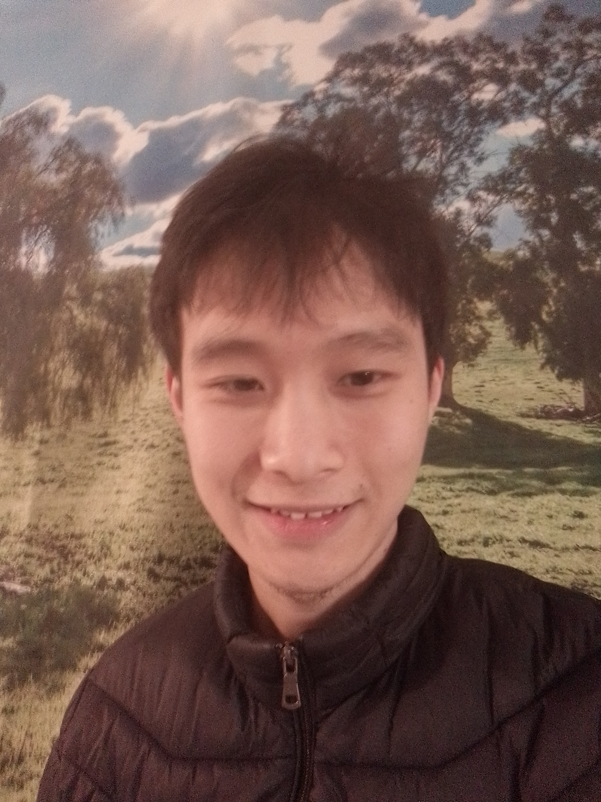

#+ATTR_HTML: :class figure

#+ATTR_HTML: :class part-one
*Nestor Liao, He/Him* \\
I like sunny day, green grass, lazy cow.\\
I learn by "forget, active, state, teach".\\
I am sleepy, relaxed, wandering in hometown.\\
"Less is More" is "Slow is Smooth, Smooth is Fast"\\

----------------------------------------------------------------------------------------------------------------------------------------------------
#+ATTR_HTML: :class part-one
$whoami || fd > [[mailto:gtkndcbfhr@gmail.com][Email]] | [[https://github.com/NestorLiao][Github]] | QQ: 2730647052 | [[https://github.com/NestorLiao.atom][RSS]]\\
----------------------------------------------------------------------------------------------------------------------------------------------------

****** Projects
#+ATTR_HTML: :class part-two
- [[https://blank.org/][《基于墨水屏的极简MP3与降噪耳机设计：面向健康监测与数字生活的创新探索》]]
- [[https://blank.org/][《可复现与形式化验证在嵌入式系统中的应用：使用Zig、Lean 4和Nix构建RTOS》]]
  
****** Thought
#+ATTR_HTML: :class part-two
- 2024-Dec-21[[https://blank.org/][GPT is my new layer to Internet]]
- 2024-Dec-20 [[file:how to stop become luigi.org::*Stop Yourself Turn into Luigi, But Why and How?][Stop Yourself Turn into Luigi, But Why and How?]]

****** Notes
#+ATTR_HTML: :class part-three
- [[https://blank.org/][Zig just Cooler C]]
- [[https://blank.org/][Rust just Cooler C++]]
- [[https://blank.org/][Linux From Scratch]]
- [[https://blank.org/][Awesome Beej's Tutor]]
- [[https://blank.org/][Python just Cooler Bash]]
- [[https://blank.org/][Bored so I Learned Lean4]]

#+ATTR_HTML: :class part-four
- [[https://blank.org/][How to Sleep]]
- [[https://blank.org/][Pedals with Emacs]]
- [[https://blank.org/][Minimalist's A5Pro]]
- [[https://blank.org/][Hand on Longevity]]
- [[https://blank.org/][My Utimate Keyboard]]
- [[https://blank.org/][Control my Screen with Rust]]

****** Tools
#+ATTR_HTML: :class part-three
+ OS: Linux/ *NixOS*
+ WM: Eink/ *Hyprland*
+ Web: Firefox/ *Tridactyl*
+ Editor: Helix/ *Emacs*
  
#+ATTR_HTML: :class part-four
+ Hobby: Motocycle/Guitar
+ SLang: English, Mandarin, Latin
+ PLang: C/C++/Zig/Rust/Python/Lean4
+ Degree: Bachelor of Science in Biomedical Engineering, CQUPT, China

******* ---------------------------------------------------------------------------------------------------------------------------------------------------------------
Sorry There is no enought room for *Doomscrolling*, But You still in *The Matrix* which I mean you can just pick your *smartphone* then get your daily *Soma*. Or you can visis *The Holy [[https://rms.sexy/][Gallery]].*

#+HTML_HEAD: <link rel="stylesheet" href="style.css">
#+HTML_HEAD: <meta charset="UTF-8">
#+HTML_HEAD: <meta name="robots" content="index, follow">
#+HTML_HEAD: <meta name="description" content="Welcome to NestorLiao's GitHub personal page, where I showcase my projects and open-source contributions.">
#+HTML_HEAD: <meta name="keywords" content="GitHub, personal page, portfolio, open-source, nesotrliao, emacs, rust, zig, eink, diy, tutor, nixos, nofap, nosurf">
#+AUTHOR: Nestor Liao
#+OPTIONS: toc:nil
#+OPTIONS: num:nil
#+KEYWORDS: nesotrliao, emacs, rust, zig, eink, diy, tutor, nixos
#+OPTIONS: num:nil
#+TITLE: NestorLiao Personal Page
#+DESCRIPTION: This is my personal page on GitHub.

